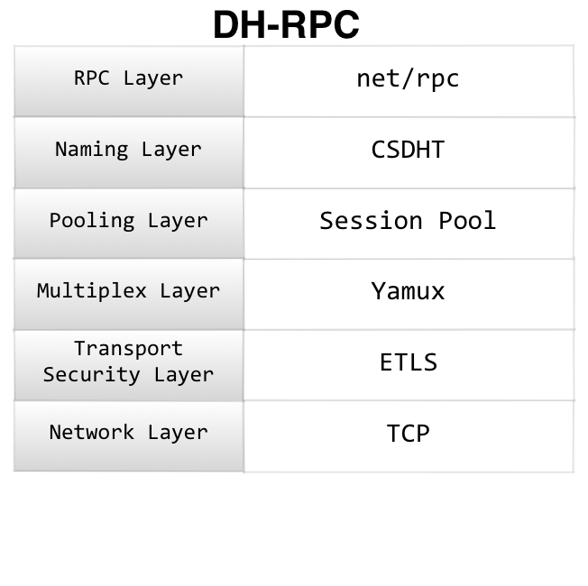
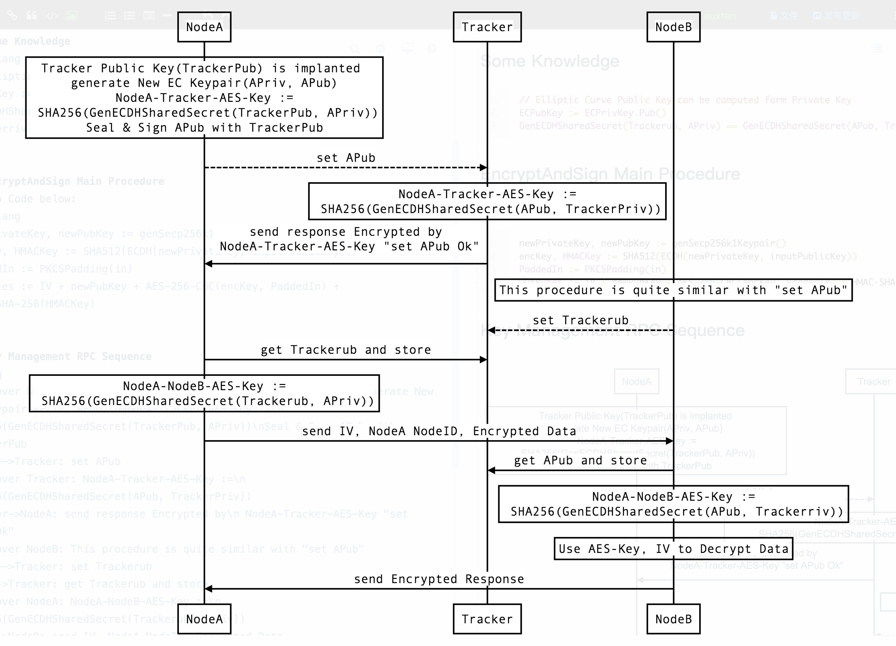

[](https://goreportcard.com/report/github.com/CovenantSQL/CovenantSQL)
[](https://codecov.io/gh/CovenantSQL/CovenantSQL/tree/develop/rpc)
[](https://travis-ci.org/CovenantSQL/CovenantSQL)
[](https://opensource.org/licenses/Apache-2.0)
[](https://godoc.org/github.com/CovenantSQL/CovenantSQL)


# DH-RPC
The traditional key exchange like TLS or SSL needs a CA to ensure key exchange run safely. But in DH-RPC I use a DHT to do that. The main idea is removing CA Cert from the whole system by using a DHT for Naming and Key Exchange.

DH-RPC is a secp256k1-ECDH-AES encrypted P2P RPC framework for decentralized applications written in golang.

CovenantSQL is built on DH-RPC, including:

- Byzantine Fault Tolerance consensus protocol [Kayak](https://godoc.org/github.com/CovenantSQL/CovenantSQL/kayak)
- Consistent Secure DHT
- DB API
- Metric Collect
- Blocks sync


## Usage


Alice Client:
```go
// Init Key Management System
route.InitKMS(PubKeyStoreFile)

// Register Node public key, addr to Tracker
reqA := &proto.PingReq{
    Node: AliceNode,
}
respA := new(proto.PingResp)
rpc.NewCaller().CallNode(Tracker.NodeID, "DHT.Ping", reqA, respA)

pc := rpc.NewPersistentCaller(BobNodeID)
respSimple := new(string)
pc.Call("Test.Talk", "Hi there", respSimple)
fmt.Printf("Response msg: %s", *respSimple)
```

Bob Server:
```go
// RPC logic
// TestService to be register to RPC server
type TestService struct {}

func (s *TestService) Talk(msg string, ret *string) error {
	fmt.Println(msg)
	resp := fmt.Sprintf("got msg %s", msg)
	*ret = resp
	return nil
}

// Init Key Management System
route.InitKMS(PubKeyStoreFile)

// Register DHT service
server, err := rpc.NewServerWithService(rpc.ServiceMap{
    "Test": &TestService{},
})

// Init RPC server with an empty master key, which is not recommend
server.InitRPCServer("0.0.0.0:2120", PrivateKeyFile, "")

// Start Node RPC server
server.Serve()
```

Tracker stuff can refer to the Example section below
    
## Features

- 100% compatible with Go [net/rpc](https://golang.org/pkg/net/rpc/) standard.
- ID based routing and Key exchange built on Secure Enhanced DHT.
- use MessagePack for serialization which support most types without writing `Marshal` and `Unmarshal`.
- Crypto Schema
    - Use Elliptic Curve Secp256k1 for Asymmetric Encryption
    - ECDH for Key Exchange
    - PKCS#7 for padding
    - AES-256-CFB for Symmetric Encryption
    - Private key protected by master key
    - Annoymous connection is also supported
- DHT persistence layer has 2 implementations:
    - BoltDB based simple traditional DHT
    - [Kayak](https://godoc.org/github.com/CovenantSQL/CovenantSQL/kayak) based 2PC strong consistent DHT
- Connection pool based on [Yamux](https://github.com/hashicorp/yamux), make thousands of connections multiplexed over **One TCP connection**.

## Stack
<p align="left">
    
</p>

  - [DH-RPC](rpc/) = TLS - Cert + DHT
    - RPC Layer: compatible with golang `net/rpc`
    - Naming Layer: [**C**onsistent **S**ecure **DHT**](https://godoc.org/github.com/CovenantSQL/CovenantSQL/consistent)
    - Pooling Layer: session pool built on Yamux
    - Multiplex Layer: Yamux by Hashicorp
    - Transport Security Layer: [**E**nhanced **TLS**](https://github.com/CovenantSQL/research/wiki/ETLS(Enhanced-Transport-Layer-Security))
    - Network Layer: TCP or KCP for optional later


## How it worked

As we all know, Elliptic Curve Public Key is computed form Private Key

```go
ECPubKey := ECPrivKey.Pub()
```

DH-RPC node is generated by hash of NodePublicKey and an [Uint256 Nonce](../pow/cpuminer/uint256.go):
```go
NodeID := sha256(blake2b-512(NodePublicKey + Uint256Nonce))
```

DHT is used to hold the `NodeID`:`PublicKey` `NodeID`:`Addr` map. A RPC connection will do ECDH to get shared secret after TCP connection established.
```go
GenECDHSharedSecret(APub, BPriv) == GenECDHSharedSecret(BPub, APriv)
```

The main procedure is described as sequence chart below:



So anyone tries to fake NodeB by overwriting the address or public key on DHT without the private key of NodeB will be failed to get the correct shared secret.

## Example

The example below is 1 tracker and 2 nodes.

Complete code can be found [here](_example/)


#### Tracker Code

```go
package main

import (
	"os"

	"github.com/CovenantSQL/CovenantSQL/conf"
	"github.com/CovenantSQL/CovenantSQL/consistent"
	"github.com/CovenantSQL/CovenantSQL/route"
	"github.com/CovenantSQL/CovenantSQL/rpc"
	"github.com/CovenantSQL/CovenantSQL/utils/log"
)

func main() {
	//log.SetLevel(log.DebugLevel)
	conf.GConf, _ = conf.LoadConfig(os.Args[1])
	log.Debugf("GConf: %#v", conf.GConf)

	// Init Key Management System
	route.InitKMS(conf.GConf.PubKeyStoreFile)

	// Creating DHT RPC with simple BoltDB persistence layer
	dht, err := route.NewDHTService(conf.GConf.DHTFileName, new(consistent.KMSStorage), true)
	if err != nil {
		log.Fatalf("init dht failed: %v", err)
	}

	// Register DHT service
	server, err := rpc.NewServerWithService(rpc.ServiceMap{route.DHTRPCName: dht})
	if err != nil {
		log.Fatal(err)
	}

	// Init RPC server with an empty master key, which is not recommend
	addr := conf.GConf.ListenAddr
	masterKey := []byte("")
	server.InitRPCServer(addr, conf.GConf.PrivateKeyFile, masterKey)
	server.Serve()
}
```

#### Node Code
```go
package main

import (
	"bufio"
	"fmt"
	"os"
	"strings"

	"github.com/CovenantSQL/CovenantSQL/conf"
	"github.com/CovenantSQL/CovenantSQL/proto"
	"github.com/CovenantSQL/CovenantSQL/route"
	"github.com/CovenantSQL/CovenantSQL/rpc"
	"github.com/CovenantSQL/CovenantSQL/utils/log"
)

// TestService to be register to RPC server
type TestService struct {
}

func NewTestService() *TestService {
	return &TestService{}
}

func (s *TestService) Talk(msg string, ret *string) error {
	fmt.Println(msg)
	resp := fmt.Sprintf("got %s", msg)
	*ret = resp
	return nil
}

func main() {
	//log.SetLevel(log.DebugLevel)
	conf.GConf, _ = conf.LoadConfig(os.Args[1])
	log.Debugf("GConf: %#v", conf.GConf)

	// Init Key Management System
	route.InitKMS(conf.GConf.PubKeyStoreFile)

	// Register DHT service
	server, err := rpc.NewServerWithService(rpc.ServiceMap{
		"Test": NewTestService(),
	})
	if err != nil {
		log.Fatal(err)
	}

	// Init RPC server with an empty master key, which is not recommend
	addr := conf.GConf.ListenAddr
	masterKey := []byte("")
	server.InitRPCServer(addr, conf.GConf.PrivateKeyFile, masterKey)

	// Start Node RPC server
	go server.Serve()

	// Register Node public key, addr to Tracker(BP)
	for _, n := range conf.GConf.KnownNodes {
		client := rpc.NewCaller()
		reqA := &proto.PingReq{
			Node: n,
		}
		respA := new(proto.PingResp)
		err = client.CallNode(conf.GConf.BP.NodeID, "DHT.Ping", reqA, respA)
		if err != nil {
			log.Fatal(err)
		}
		log.Debugf("respA: %v", respA)
	}

	// Read target node and connect to it
	scanner := bufio.NewScanner(os.Stdin)
	fmt.Print("Input target node ID: ")
	scanner.Scan()
	if scanner.Err() == nil {
		target := proto.NodeID(strings.TrimSpace(scanner.Text()))
		pc := rpc.NewPersistentCaller(target)
		log.Debugf("connecting to %s", scanner.Text())

		fmt.Print("Input msg: ")
		for scanner.Scan() {
			input := scanner.Text()
			log.Debugf("get input %s", input)
			repSimple := new(string)
			err = pc.Call("Test.Talk", input, repSimple)
			if err != nil {
				log.Fatal(err)
			}
			log.Infof("resp msg: %s", *repSimple)
		}
	}
}
```

Start tracker and node1, node2
```bash
$ ./runTracker.sh &
$ ./runNode2.sh &
$ ./runNode1.sh
$ Input target node ID: 000005aa62048f85da4ae9698ed59c14ec0d48a88a07c15a32265634e7e64ade #node2
$ Input msg: abcdefg
```


