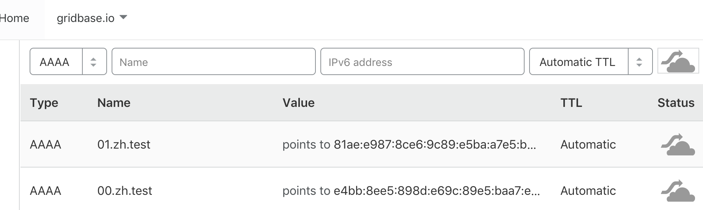

# Beacon
Beacon is the best way to store public ~persistent~ key-value data 
in the Open Internet. Data saved to Beacon is redundantly stored in
[`BitTorrent Tracker`](https://en.wikipedia.org/wiki/BitTorrent_tracker),
[`ED2K`](https://en.wikipedia.org/wiki/EDonkey_network),
[`Kad`](https://en.wikipedia.org/wiki/Kad_network),
and [`IPv6 DNS`](https://en.wikipedia.org/wiki/IPv6_address)(readonly, need to set manually).

## Current

#### Ready:
- [`IPv6 DNS`](https://en.wikipedia.org/wiki/IPv6_address) [Reader & Generator](#ipv6)

#### Todo:
- [`BitTorrent Tracker`](https://en.wikipedia.org/wiki/BitTorrent_tracker)
- [`ED2K`](https://en.wikipedia.org/wiki/EDonkey_network)
- [`Kad`](https://en.wikipedia.org/wiki/Kad_network)

### Install

```go
go get -u github.com/CovenantSQL/beacon
```

### IPv6

#### Generate AAAA Records
```bash
$ echo "从前有座山の里有座庙12" | beacon -trim -domain zh.test.optool.net                 
Generated IPv6 addr:
;; AAAA Records:
00.zh.test.optool.net	1	IN	AAAA	e4bb:8ee5:898d:e69c:89e5:baa7:e5b1:b1e3
01.zh.test.optool.net	1	IN	AAAA	81ae:e987:8ce6:9c89:e5ba:a7e5:ba99:3132
```

#### Set in your DNS Vendor



#### Read from DNS
Raw:
```bash
$ beacon -mode ipv6 -domain zh.test.optool.net
INFO[0000] #### zh.test.optool.net ####                   
从前有座山の里有座庙12
INFO[0000] #### zh.test.optool.net ####         
```
Hex:
```bash       
$ beacon -mode ipv6 -domain zh.test.optool.net -hex
INFO[0000] #### zh.test.optool.net ####                   
e4bb8ee5898de69c89e5baa7e5b1b1e381aee9878ce69c89e5baa7e5ba993132
INFO[0000] #### zh.test.optool.net ####                   
```